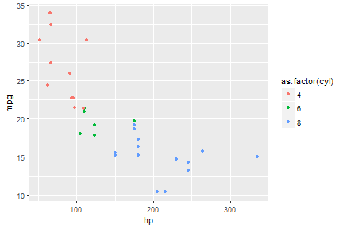

Deceiving Data
======================================================== 
author: MLMV 
date: February 12, 2017 
autosize: true
font-family: 'Calibri'
transition: rotate
css: custom.css

Simpson's Paradox
========================================================
A great benefit of the digital age is that large, multivariate data sets can
generate insights that would have been impossible to find in earlier days.

Unfortunately, all that Big Data can also be misleading. Popular magazines and
TV advertisments are frequently found guilty of coming up with misleading information, in an attempt to lure consumers into their fold.

Simpson's paradox (or the Yule-Simpson effect) is a phenomenon in probability 
and statistics, whereby a trend appears in different groups of data, which
disappears or reverses when these groups are combined.

Example
========================================================
type: Col1
<small>An example of Simpson's Paradox is when the University of California, 
Berkeley was sued for bias against women who had applied for admission to 
graduate schools in 1973. Admission figures showed that men applying were more 
likely than women to be admitted, and the difference was so substantial that one
would conclude that discrimination existed.</small>
***
<small> However, when examining individual departments, it appeared that no
department was significantly biased against women (Bickel, Hammel, and O'Connell
1975). In other words, there was no significant difference between the number of
men and women admitted when looking at departmental groups; but this finding
reversed (suggesting that more men were admitted than women) when the groups
were combined.</small>

Other issues
========================================================
incremental: true
Other issues with data analysis or visualization that can lead to
misunderstanding and incorrect analytical outcomes are:

* Not showing the entire scale of the data 
* Using scales that are irrelevant to the data
* Using a subsection of the data to support a given conclusion
* Showing data out of context
* Using irrelevant or opportunistic subgroups
* Falsely implying relationships between variables

About this application
========================================================
The [Paradox](http://mlmv.shinyapps.io/paradox/) application demonstrates how common mistakes in data analysis can lead to spurious conclusions. 

By selecting certain subsections of the mtcars data, users can visualize different results of a linear regression of miles per gallon regressed on horsepower.

Have fun!
***


```r
library(ggplot2); ggplot(data = mtcars, aes(x = hp, y = mpg, colour = as.factor(cyl))) + geom_point()
```
